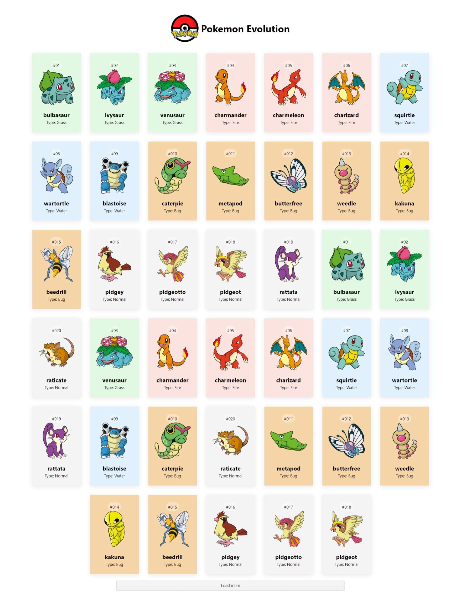

# PokeAPI 01
This design is inspired by this [video](https://youtu.be/CZBWT7MQYr0), which belongs to [Coding With Siphiwo](https://www.youtube.com/@siphiwocode).

## Technologies
This web page was made with the following technologies:
- HTML5
- CSS3
- JavaScript
- React (useState, useEffect)

## Pages
This web page contains 1 sections: **Home**.

### Home
#### In this section you will see different pokemons with their name, their id, and their type, they are also classified by color according to their type. At the end of the list, there is a functional button, where if you click it, the following 20 pokemon will be loaded.

